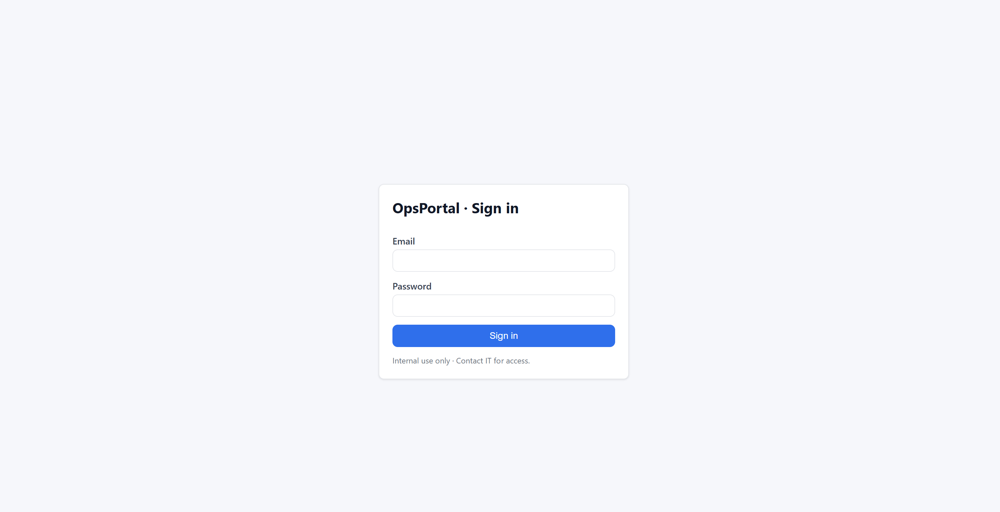
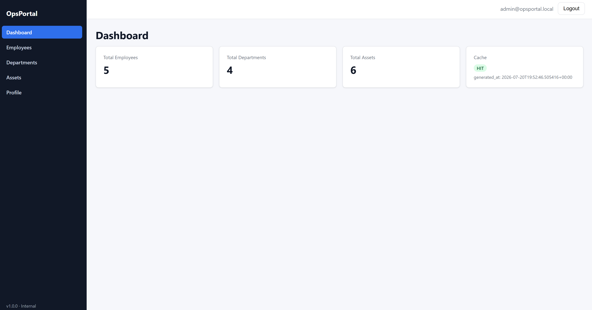
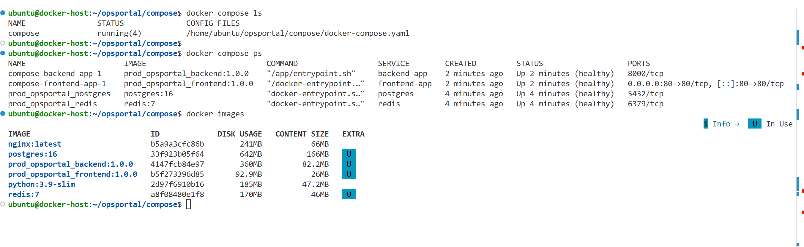

# Docker Production Stack


A production-oriented Docker project demonstrating containerization, monitoring, security scanning and automated deployment on AWS.

The sample application (Flask + React) is used to showcase production deployment practices including Docker Compose, Nginx, GitHub Actions, Prometheus, Grafana, Trivy, AWS OIDC and AWS Systems Manager.

---

# Features

* Multi-stage Docker builds
* Docker Compose orchestration
* Nginx reverse proxy
* PostgreSQL & Redis integration
* Prometheus monitoring
* Grafana dashboards
* cAdvisor container metrics
* Node Exporter host metrics
* GitHub Actions CI/CD
* Trivy vulnerability scanning
* Docker Hub image publishing
* AWS deployment using GitHub OIDC and Systems Manager (SSM)

---

# Technology Stack

| Category         | Technologies                                 |
| ---------------- | -------------------------------------------- |
| Containerization | Docker, Docker Compose                       |
| Reverse Proxy    | Nginx                                        |
| Backend          | Python Flask                                 |
| Frontend         | React                                        |
| Database         | PostgreSQL                                   |
| Cache            | Redis                                        |
| Monitoring       | Prometheus, Grafana, cAdvisor, Node Exporter |
| CI/CD            | GitHub Actions                               |
| Security         | Trivy, GitHub OIDC                           |
| Cloud            | AWS EC2, IAM, Systems Manager                |

---

# Architecture

```text
                        Internet
                            │
                            ▼
                      Nginx Reverse Proxy
                            │
              ┌─────────────┴─────────────┐
              ▼                           ▼
        React Frontend              Flask Backend
                                            │
                              ┌─────────────┴─────────────┐
                              ▼                           ▼
                         PostgreSQL                   Redis

────────────────────────────────────────────────────────────

Node Exporter ─┐
cAdvisor ──────┼────► Prometheus ─────► Grafana
               │
Docker Host ───┘
```

---

# CI/CD Pipeline

```text
Developer
    │
    ▼
Git Push
    │
    ▼
GitHub Actions
    │
    ├── Build Images
    ├── Trivy Scan
    ├── Push to Docker Hub
    ├── AWS OIDC Authentication
    └── Deploy via AWS SSM
             │
             ▼
         EC2 Instance
             │
             ▼
     Docker Compose Stack
```

---

# Project Structure

```text
.
├── backend/
├── frontend/
├── compose/
├── monitoring/
├── nginx-conf/
├── backup/
├── docs/
├── .github/workflows/
└── README.md
```

---

# Screenshots

| Login                                | Dashboard                           |
| ------------------------------------ | ----------------------------------- |
|  |  |

Container Stack



---

# Documentation

Detailed documentation is available in the **docs** directory.

* [Architecture](docs/architecture.md)
* [Deployment Guide](docs/deployment.md)
* [CI/CD Pipeline](docs/cicd.md)
* [Monitoring](docs/monitoring.md)
* [Security](docs/security.md)
* [Troubleshooting](docs/troubleshooting.md)

---

# Related Projects

This repository focuses on Docker, deployment automation and operations.

AWS infrastructure is provisioned separately using Terraform.

| Repository                             | Purpose                                                                                                                          |
| -------------------------------------- | -------------------------------------------------------------------------------------------------------------------------------- |
| **github-oidc-aws_platform_terraform** | Provisions AWS infrastructure including EC2, IAM roles, GitHub OIDC provider and supporting resources required for this project. |

---

# Getting Started

```bash
git clone <repository-url>

cd docker-production-stack

cp compose/.env.example compose/.env

docker compose -f compose/docker-compose.yaml up -d
```

---

# Future Enhancements

* Kubernetes deployment
* Amazon ECR support
* Helm charts
* Container image signing
* Docker Secrets / AWS Secrets Manager
* Centralized log aggregation

---

# License

This project is licensed under the MIT License.
